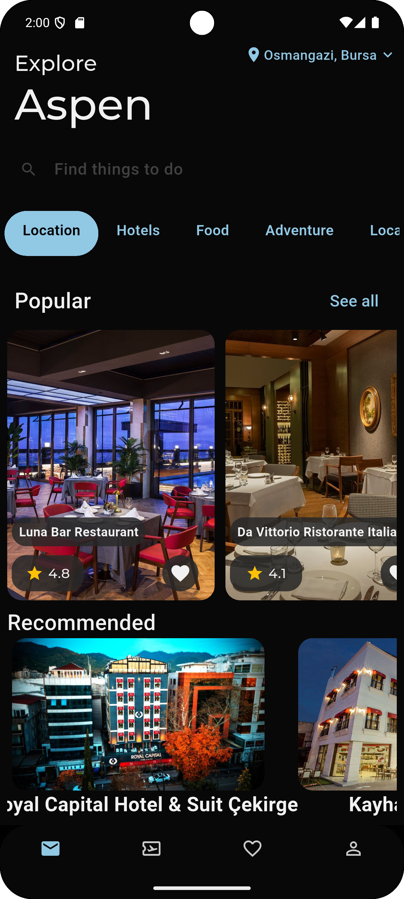
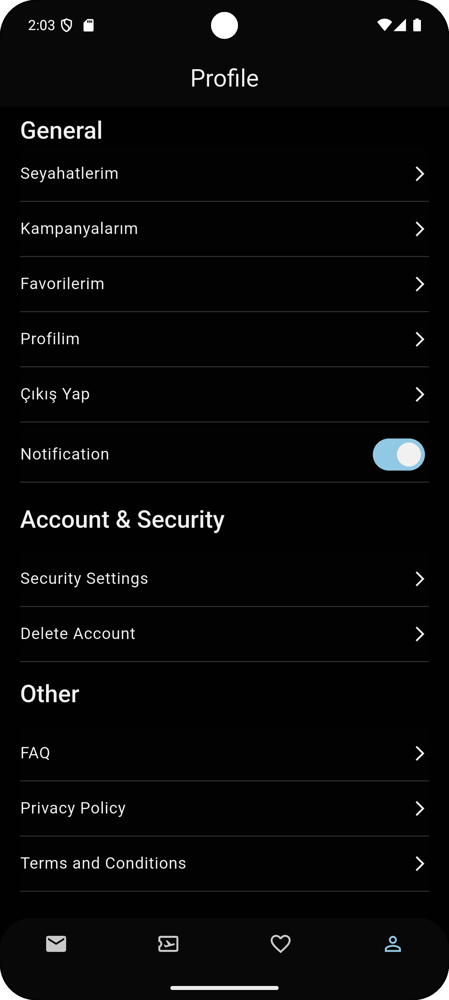
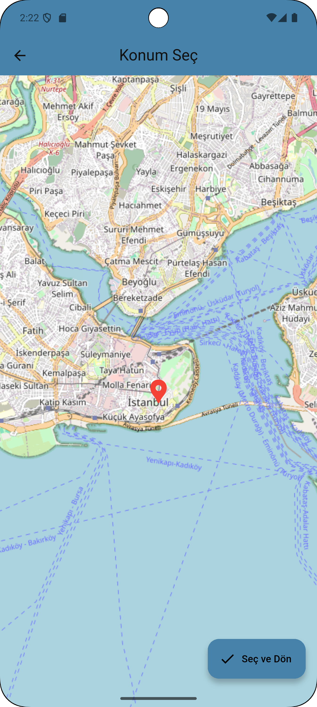
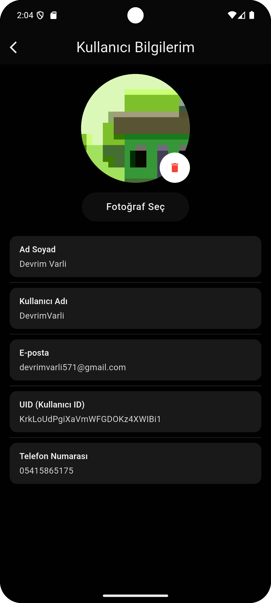
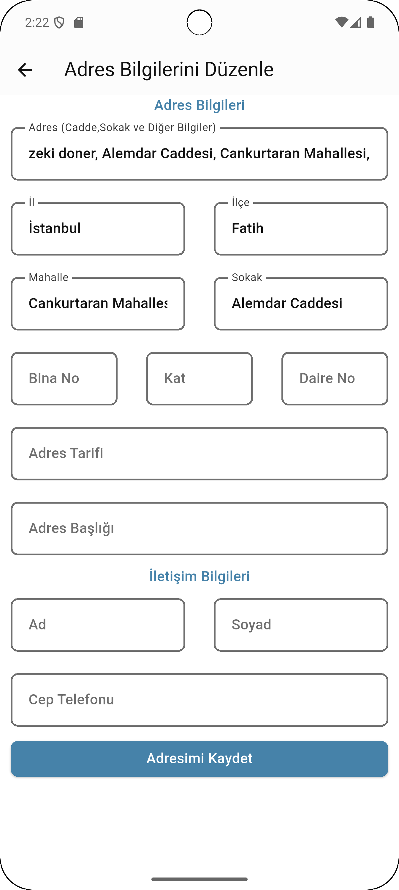

# ✨ **GezginRotaRehberi** - Keşfet, Favori Yap, Yönlendir!

**GezginRotaRehberi ile**, kullanıcılar çevredeki **restoranları**, **otelleri** keşfedebilir, favori yerlerini işaretleyebilir ve profil ayarlarını kolayca yönetebilir.

---
## 🚀 **Öne Çıkan Özellikler** 🔥

- **Konum Bazlı Keşif**: Kullanıcı, **bulunduğu konuma** göre mekanları filtreleyebilir, *Hotels*, *Food*, *Adventure* gibi kategorilerde önerilere ulaşabilir.
  
- **Popüler Mekanlar**: Yüksek kullanıcı yorumlarına ve puanlara sahip mekanlar öne çıkarılır, böylece **en popüler yerler** keşfedilebilir.

- **Detaylı Mekan Sayfası**: Her mekan için görsel galeri, kullanıcı oylaması, detaylı açıklamalar ve **"Book Now"** butonu ile hızlı rezervasyon yapılabilir.

- **Favoriler Yönetimi**: Mekanları **favorilere ekleyin**, listede gösterin ve favorilere hızla erişin.

- **Kullanıcı Profili**: Profil fotoğrafı güncelleme, **AdSoyad**, **Kullanıcı Adı**, **E-posta**, **UID**, **Telefon Numarası** gibi bilgileri kolayca düzenleyebilirsiniz.

- **Adres Yönetimi**:
  - Kullanıcı, teslimat adreslerini **ekleyebilir**, **düzenleyebilir** ya da **silebilir**.
  - **GPS ile lokasyon seçimi** ya da **manuel adres girişi** yapılabilir.
  - Kayıtlı adres başlığını (**"evim"** gibi) özelleştirebilirsiniz.
  
---

## 📸 **Uygulama Ekran Görüntüleri** 🎨

### 🔐 **Giriş Ekranı** - Kendi profilinize hoş bir başlangıç yapın!

  
  
  

  **Giriş Ekranı** | **Ana Ekran** | **Intro Ekranı**

### 👤 **Profil Ekranı** - Kişisel bilgilerinizi kolayca yönetin

  
  
  

  **Profil Ekranı** | **Favori Ekranı** | **Harita Ekranı**

### 📝 **Detay Ekranı** - Mekanları detaylı şekilde keşfedin

  
  
  

  **Detay Ekranı** | **Account Info Ekranı** | **Adres Ekleme Ekranı**

---

## 🛠️ **Teknolojiler / Teknoloji Akışı** 🔧

- **Platform**: Flutter & Dart 💻
- **Mobil Tasarım**: Siyah temalı modern UI, **segment kontrol** (Favoriler: Restoranlar / Oteller), dinamik ve kullanıcı dostu tasarım.
- **Konum Entegrasyonu**: Harita üzerinde **pin ile lokasyon seçimi** yapılabilir (OpenStreetMap veya Google Maps SDK).
- **Veri Depolama**: **Firebase Auth & Firestore** kullanılarak kullanıcı profil ve favori mekanlar saklanabilir.
- **Favoriler & Mekan Bilgileri**: **JSON** / **API** yapısıyla mekan bilgileri dinamik şekilde gösterilir (resimler, isimler, puanlar, açıklamalar vs.).
- **Adres Girişi**: Kullanıcı adres bilgilerini **form tabanlı** girişle kolayca kaydedebilir, düzenleyebilir veya silebilir.

---

