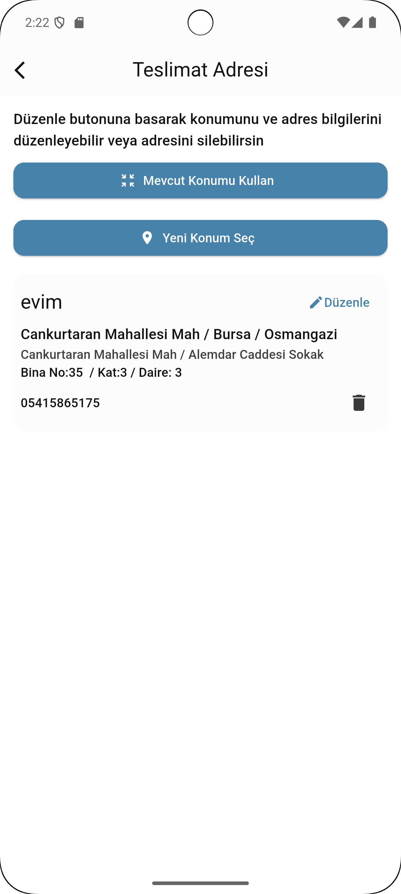

# ✨ Explore & Discover App

**Aspen ile**, kullanıcılar çevredeki restoranları, otelleri keşfedebilir, favori yerlerini işaretleyebilir ve profil ayarlarını kolayca yönetebilir.

---

## 🚀 Öne Çıkan Özellikler

- **Konum Bazlı Keşif**: Kullanıcı bulunduğu lokasyona göre mekanları filtreleyebilir, *Hotels*, *Food*, *Adventure* gibi kategorilerde listelenmiş önerilere ulaşabilir.  
- **Popüler Mekanlar**: Öne çıkarılan restoran ve oteller, kullanıcı yorumları ve puanlarına göre listeleniyor.
- **Detaylı Mekan Sayfası**: Her mekan için; görsel galeri, kullanıcı oylaması, tanım ve "Book Now"/"Rezervasyon Yap" butonu mevcut.
- **Favoriler Yönetimi**: Restoran ve otelleri favorilere ekleme, listede gösterme ve hızlı erişim.
- **Kullanıcı Profili**: Kullanıcı bilgileri, profil fotoğrafı güncelleme, AdSoyad, KullanıcıAdı, e‑posta, UID ve telefon numarası görüntüleme.
- **Adres Yönetimi**:
  - Kullanıcı teslimat adreslerini ekleyebilir, düzenleyebilir ya da silebilir.
  - GPS ile mevcut konum seçme veya manuel adres girişi.
  - İl/İlçe/Mahalle/Sokak gibi alanlarda veri doğrulama.
  - Kayıtlı adres başlığını (“evim” gibi) özelleştirebilme.

---

## 📸 Uygulama Ekran Görüntüleri

### 🔐 Giriş Ekranı

### 🏠 Ana Ekran

### 🚀 Intro Ekranı

### 👤 Profil Ekranı

### ⭐ Favoriler Ekranı

### 🗺️ Harita Ekranı

### 📝 Detay Ekranı

### 🧾 Hesap Bilgileri

### ➕ Adres Ekleme

### 📍 Adreslerim

## 🛠️ Teknolojiler / Teknoloji Akışı

- **Platform**: Flutter & Dart
- **Mobil Tasarım**: Siyah temalı UI, modern widget yapısı, segment kontrol (Favoriler: Restoranlar / Oteller).
- **Konum Entegrasyonu**: Haritada pin ile lokasyon seçimi (OpenStreetMap veya Google Maps SDK vb).
- **Veri Depolama**: Kullanıcı profil ve favori mekanlar için Firebase Auth & Firestore ya da benzeri bir backend kullanılabilir.
- **Favoriler & Mekan Bilgileri**: JSON / API yapısıyla listelenen mekan verisi (resim, isim, puan, açıklama vs.).
- **Adres Girişi**: Form tabanlı inputlarla; adres kaydetme/düzenleme iş akışı.

---

## 📂 Proje Yapısı (Öneri)

